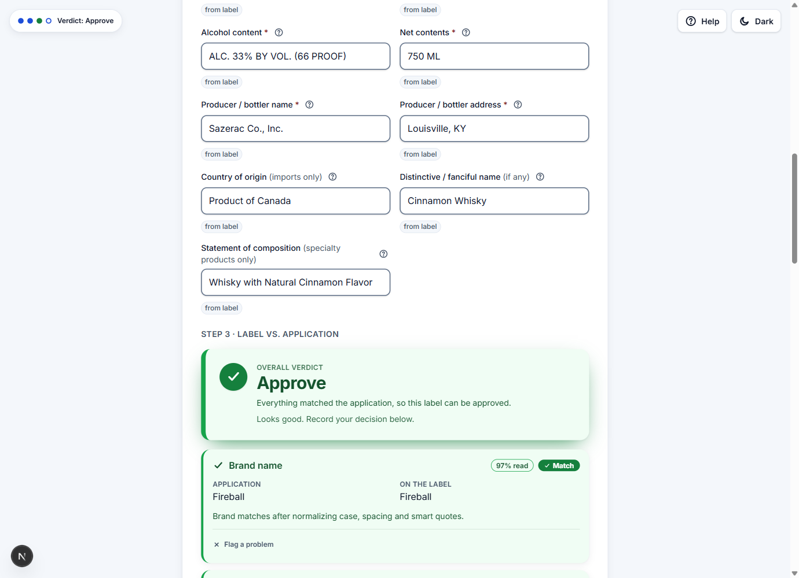

# TTB Label Verifier

Upload a photo of an alcohol label. AI reads it into the full set of TTB-required fields, then
deterministic code checks the label against the application's claimed values and against TTB's
labeling rules, and returns an at-a-glance verdict: **Approve / Needs review / Reject**.

**Live demo:** https://ttb-label-verifier-matthew-nolan-s-projects.vercel.app
(runs a real vision model, so it can read any label photo)



Built for the take-home brief: the three core checks (brand name, alcohol content, government
health warning) lead the screen. The same engine also extracts the full TTB field set (killing the
manual data entry the agents complained about), runs a per-beverage-type completeness check, exports
JSON/CSV, and handles batch uploads.

## Try it in two minutes

1. Open the [live demo](https://ttb-label-verifier-matthew-nolan-s-projects.vercel.app).
2. Grab a sample label: the demo's upload screen offers all three as one-click downloads ("No
   label handy?"), or use the links in the table below (on GitHub, open the link and use the
   "Download raw file" button). Any bottle photo of your own works too.
3. Upload it as the front label. The AI reads it and pre-fills "The application" inputs with grey
   suggestions; press Tab to accept one, or click **Accept all AI suggestions**. (In real use the
   agent would type what the COLA (Certificate of Label Approval) application claims. Accepting
   the suggestions simulates an application that matches the label.)
4. The verdict appears as soon as every field TTB requires for the beverage type is filled in.

| Sample label | The defect on the label | What to enter | Expected verdict |
| --- | --- | --- | --- |
| [Clean bourbon](eval/fixtures/images/demo-old-tom-clean.png) | none | accept all suggestions | **Approve** |
| [Title-case warning](eval/fixtures/images/demo-warning-title-case.png) | warning prefix printed "Government Warning:" instead of all-caps bold "GOVERNMENT WARNING:" | accept all suggestions | **Reject**. 27 CFR 16.22(a)(2) requires the all-caps bold prefix |
| [Brand typo](eval/fixtures/images/demo-brand-typo.png) | label prints "Old Tomm Distillery" (extra "m") | type **Old Tom Distillery** as the brand, accept the rest | **Needs review**. A near-miss is routed to a human, not auto-decided |

You never type the government warning: the tool compares the label's warning text word for word
against the statutory text automatically. (Live model reads can occasionally vary; locally, the
offline mock reproduces these verdicts deterministically.)

For the batch workflow (the brief's importers dumping 200 to 300 applications at once), open
[/batch](https://ttb-label-verifier-matthew-nolan-s-projects.vercel.app/batch): drop many images,
fronts and backs pair by filename, optionally attach a CSV of claimed values (a template is
downloadable on the page), and results stream into a reviewable worklist with CSV export.

## Run it locally

```bash
npm install
npm run dev        # http://localhost:3000, zero API keys needed
```

Requires Node 20.9+. With no keys the app runs on an offline **mock** provider: it recognizes the
bundled sample labels by filename (including the three above, which yield the same verdicts
locally) but cannot read arbitrary photos. To read your own images locally,
[enable a real vision provider](#enable-a-real-vision-provider); the live demo already runs one.

```bash
npm test           # unit + integration + component tests (offline, no keys, deterministic)
npm run eval       # accuracy + latency over labeled fixtures; gates CI (see below)
npm run typecheck  # strict TypeScript
npm run lint
npm run build      # production build (Next standalone)
```

## How it works: AI extracts, code decides

```
image(s) ──> VisionProvider(s) ──> reconciler ──> completeness check + comparator ──> verdict
             (probabilistic)       (agree/disagree)  (pure, deterministic, tested)
```

- **Extraction is probabilistic, so it never gets the final word.** Vision models read the
  front/back/neck images together into one structured record with per-field confidence. Every
  pass/review/fail decision is made afterwards by pure, unit-tested code. In a government context,
  the answer to "why was this rejected?" must be rules-based and reproducible, so a model never
  makes the compliance verdict.
- **Providers are swappable behind one interface.** `mock` (default, offline), `openai`,
  `gemini`, `llm` (Azure OpenAI), `ocr` (Azure AI Document Intelligence), and `ensemble`
  (both Azure providers in parallel, disagreements routed to review). Adding Gemini was a ~150-line
  drop-in behind the [`VisionProvider`](src/extraction/VisionProvider.ts) interface.
- **The real providers use current best practice.** Strict structured outputs
  (`response_format: json_schema` on the OpenAI-dialect providers, Gemini's `responseSchema`
  equivalent) so the model is constrained to the exact field shape; bounded retry on 429/5xx and a
  self-limiting per-call timeout on every real provider. Each image is read N times in parallel
  (self-consistency, default 3) and per-field confidence is the agreement fraction across reads,
  which is better calibrated than a model's self-reported confidence. A dedicated second pass
  judges whether the "GOVERNMENT WARNING:" prefix is printed in bold.
- **The rules live once, in a CFR-verified module.** The canonical warning text, the per-class
  alcohol tolerance matrix, and the mandatory-elements matrix are hand-written in
  [`src/domain/`](src/domain/README.md) with inline CFR citations, and treated as statutory:
  never reworded or retuned to make a test pass.
- **Uncertainty routes to a human.** Low-confidence fields downgrade to review; an unreadable
  photo gets a "please re-upload" prompt instead of a guessed verdict; the verdict takes the worse
  of the application comparison and the completeness check, so a label missing a TTB-mandatory
  element can never be auto-approved.

## Design decisions, traced to the brief

Every major choice maps to a person from the discovery interviews. (Full requirement trace in
[`specs/PROJECT_SPEC.md`](specs/PROJECT_SPEC.md).)

| Who | Their need | What was built |
| --- | --- | --- |
| **Sarah**, Deputy Director | A prior scanner took 30-40s per label and was abandoned: results must come back in about 5 seconds.<br>Agents range from fresh graduates to a 73-year-old benchmark user.<br>Importers dump 200-300 applications at once | A hard latency budget: providers run in parallel with a per-call timeout (~3s mock / ~8s real), reconciling whatever returned instead of blocking on a straggler.<br>One accessibility-first screen (WCAG 2.1 AA targets: 4.5:1 contrast, 44px targets, full keyboard order, visible focus).<br>Batch upload with streaming results and CSV export |
| **Marcus**, IT | The outbound firewall blocked the last vendor's ML endpoints. Azure shop. Standalone prototype, no PII | Extraction sits behind a swappable `VisionProvider` interface and the production providers are Azure-native, so the model calls run inside the tenant the firewall trusts. No auth, no PII stored, no COLA integration. Mock mode means the app and full test suite run with zero keys |
| **Dave**, 28-year agent | "STONE'S THROW" vs "Stone's Throw" is obviously the same product; pure pattern matching creates false rejections | Fuzzy brand comparison: normalize case, whitespace, punctuation, and smart quotes, then compare. Exact after normalization passes; a near-miss goes to review with the discrepancy shown; only a clear mismatch fails |
| **Jenny**, junior agent | The warning must match word for word, and "GOVERNMENT WARNING:" must be all-caps and bold. Title case gets rejected. Bad photos shouldn't crash the flow | Strict verbatim comparison against the statutory text, plus explicit all-caps and bold checks on the prefix (bold is tri-state: "undetectable" is routed to review, not called a violation). Unreadable images fail gracefully to a re-upload prompt |

The unifying thesis (expanded in [`AGENTS.md`](AGENTS.md)): be superhuman on the axes where
machines win (consistency, throughput, tireless recall of routine checks) while routing ambiguity
to a human. Thresholds are deliberately asymmetric: an unnecessary review is cheap, a false
approval is not.

## Measured, not claimed

`npm run eval` runs the full pipeline offline over labeled fixtures
([`eval/fixtures/cases.json`](eval/fixtures/cases.json)): clean labels plus deliberately broken
ones (title-case warning, out-of-tolerance ABV, brand typo, missing warning, an unreadable photo
that must never auto-approve). It prints per-field precision/recall and latency p50/p95, and it is
a hard gate: if precision on "approve" drops below **0.98**, the run exits non-zero and
[CI fails](.github/workflows/ci.yml). A false approval is the one error class this tool refuses to
ship.

The offline latency it prints is sub-millisecond because the mock skips the model call; it measures
the pipeline, not a vision model. In informal testing on the hosted demo, real reads return in
roughly 1-4s, inside the ~5s budget (uploads are downscaled in the browser to keep them there);
systematic real-provider p50/p95 should be captured from a keyed deployment and is noted as a
limitation.

## Assumptions and trade-offs

- **Mock provider by default, real extraction opt-in.** Everything runs hermetically with no
  network and no keys, which keeps tests and CI deterministic. The cost: out of the box you
  exercise the pipeline and verdict logic, not a real model's reading accuracy. The live demo runs
  a real provider so reviewers get both.
- **Test fixtures key off the image filename, not pixels.** That is what makes the offline suite
  possible. The defect fixtures are lightweight SVG placeholders; the three demo labels are real
  rasters so a live provider extracts genuine pixels from them.
- **The application is required for a verdict.** The brief's core task is "does the label match
  the application", so the screen leads with that comparison and blocks the verdict until the
  TTB-required fields for the beverage type are supplied. The label read and completeness check
  still render without one.
- **Azure is the chosen cloud, not a multi-cloud abstraction.** The in-tenant Azure providers are
  the answer to Marcus's firewall constraint. The interface stays generic; OpenAI and Gemini
  providers exist for keyless-Azure demo situations, and the public demo uses one.
- **The alcohol tolerance is selected by beverage class, from the CFR.** Spirits ±0.3pp, wine
  ±1.5pp/±1.0pp around the 14% tax-class boundary, malt ±0.3pp with the 0.5% floor, each with its
  carve-outs (alcohol content is even optional on malt labels by default). The full matrix, the
  citations, and the two judgment calls flagged "VERIFY before production" live in
  [`src/domain/`](src/domain/README.md).
- **The government warning text is statutory and verbatim** (27 CFR 16.21, re-verified unchanged
  as of 2026-06). It lives once in [`src/domain/warning.ts`](src/domain/warning.ts), guarded by a
  byte-for-byte unit test. The 2025 Surgeon General cancer advisory is a proposal, not law; if
  Congress amends the text, the fix is editing that one constant.
- **Deliberate scope cuts.** No COLA integration, no auth, no PII storage, no image
  deskewing/glare correction (bad photos get a re-upload prompt, per the brief's guidance), and no
  physical type-size checks (millimeter minimums can't be measured from extracted text).
- **No rate limiting on the demo endpoint.** `/api/verify` is unauthenticated and, with a real
  provider configured, fans out to multiple model calls per request, so a hammering client could
  exhaust the demo key's quota. Uploads are size- and type-capped, but per-client throttling is
  left to the platform or an API gateway in a real deployment; documented here rather than
  hand-rolling middleware into a prototype.
- **One build-time network fetch.** `next/font/google` downloads the Inter font during
  `npm run build` only. Dev, tests, and the running app are fully offline; a strictly air-gapped
  build would swap in `next/font/local`.

## Enable a real vision provider

Optional: the default `mock` needs nothing. Set `VISION_PROVIDER` plus the matching variables
(all documented in [`.env.example`](.env.example)) in `.env.local`:

```bash
# Option A: OpenAI directly (simplest, one key)
VISION_PROVIDER=openai
OPENAI_API_KEY=sk-...

# Option B: Google Gemini directly (one key, from aistudio.google.com/apikey)
VISION_PROVIDER=gemini
GEMINI_API_KEY=...

# Option C: Azure OpenAI (the in-tenant production target)
VISION_PROVIDER=llm
AZURE_OPENAI_ENDPOINT=https://<your-resource>.openai.azure.com
AZURE_OPENAI_API_KEY=<key>
AZURE_OPENAI_DEPLOYMENT=<your-vision-capable-deployment>

# Option D: Azure AI Document Intelligence (dedicated OCR)
VISION_PROVIDER=ocr
AZURE_DOCUMENT_INTELLIGENCE_ENDPOINT=https://<your-resource>.cognitiveservices.azure.com
AZURE_DOCUMENT_INTELLIGENCE_KEY=<key>

# Option E: ensemble, both Azure providers in parallel with disagreement -> review (needs both sets)
VISION_PROVIDER=ensemble
```

If a selected provider's variables are missing, the request fails loudly with an actionable error.
It never silently falls back to the mock and pretends to read the image.

## Deploying

**Vercel (the live demo).** Zero config: Vercel detects Next.js and auto-deploys from `main`. Set
`VISION_PROVIDER` and the provider key in Settings -> Environment Variables so the hosted app reads
real uploads; with none set it serves mock mode.

**Azure (the in-tenant production target).** The real extractors run inside the Azure tenant,
which is what survives the outbound firewall that killed the previous vendor. Either path works
with zero keys (mock mode) and picks up real extraction later via app settings. Both assume the
[Azure CLI](https://learn.microsoft.com/cli/azure/install-azure-cli) and `az login`.

```bash
az group create --name ttb-label-verifier-rg --location eastus

# Path A: App Service (simplest)
npm install && npm run build
az webapp up --name ttb-label-verifier --resource-group ttb-label-verifier-rg \
  --runtime "NODE:20-lts" --sku B1
# optional, to enable real extraction on the running app:
az webapp config appsettings set \
  --name ttb-label-verifier --resource-group ttb-label-verifier-rg \
  --settings VISION_PROVIDER=llm \
             AZURE_OPENAI_ENDPOINT="https://<res>.openai.azure.com" \
             AZURE_OPENAI_API_KEY="<key>" \
             AZURE_OPENAI_DEPLOYMENT="<deployment>"

# Path B: Container Apps (uses the repo's multi-stage Dockerfile)
az acr create --resource-group ttb-label-verifier-rg --name ttblabelverifieracr --sku Basic
az acr build --registry ttblabelverifieracr --image ttb-label-verifier:latest .
az containerapp up --name ttb-label-verifier --resource-group ttb-label-verifier-rg \
  --image ttblabelverifieracr.azurecr.io/ttb-label-verifier:latest \
  --target-port 3000 --ingress external
```

## Project layout

| Path | Purpose |
| --- | --- |
| [`src/domain/`](src/domain/README.md) | CFR-verified rules: canonical warning, tolerance matrix, mandatory-elements matrix |
| [`src/extraction/`](src/extraction) | `VisionProvider` interface, the six providers, reconciler, self-consistency |
| [`src/compare/`](src/compare) | Deterministic comparators, completeness check, thresholds, combined verdict |
| [`src/pipeline.ts`](src/pipeline.ts) | The end-to-end flow: read images, merge, gate on readability, verdict |
| [`src/app/`](src/app) | The verify screen, `/api/verify` route, `/batch` worklist |
| [`eval/`](eval) | Evaluation harness + labeled fixtures (the CI accuracy gate) |
| [`AGENTS.md`](AGENTS.md) | The project bible: architecture, the three checks, conventions |
| [`specs/PROJECT_SPEC.md`](specs/PROJECT_SPEC.md) | Requirements traced to the stakeholder interviews |

**Stack:** Next.js 16 (App Router) + React 19 + TypeScript (strict) + Tailwind 4 + Vitest. No
database, no other runtime dependencies. AI: Google Gemini / OpenAI (hosted demo) and Azure OpenAI
/ Azure AI Document Intelligence (in-tenant target), all behind one interface.
